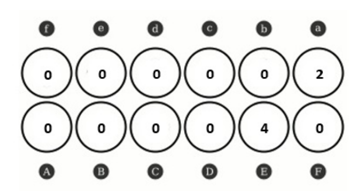
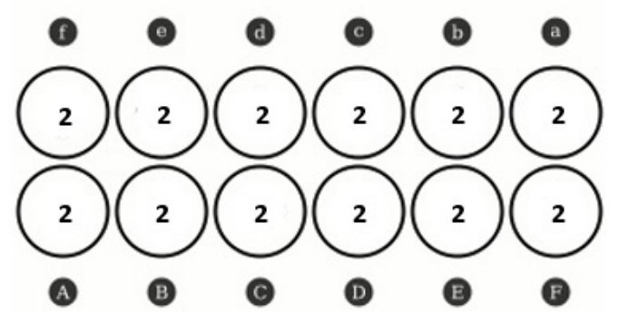
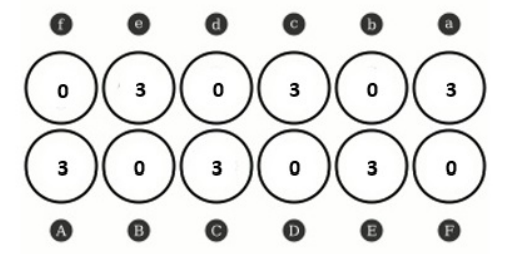
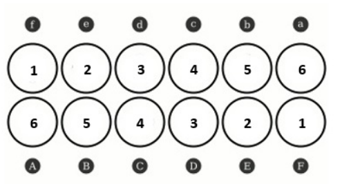
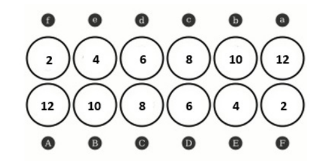
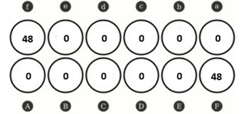
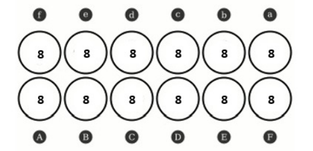

# **MANUAL TÉCNICO**: Trabalho prático 1

Inteligência Artificial - Escola Superior de Tecnologia de Setúbal  

Docente : Prof. Joaquim Filipe  
Alunos:
- 202100723 Rúben Dâmaso
- 201902108 André Castanho

## **Indice**

* Introdução
* Objetivos do Projeto
* Descrição dos objetos do projeto
* Limitações e Opções Técnicas
* Organização do Código
* Algoritmo Geral e Estrutura do Código
* Lista de Requisitos não implementados

## **1. Introdução**

Este documento descreve o funcionamento do projeto, incluindo os algoritmos implementados, a estrutura geral do código, as decisões técnicas tomadas, as limitações identificadas, e a análise dos resultados obtidos. Além disso, apresenta comparações de desempenho entre os algoritmos usados (BFS, DFS e A*) e lista os requisitos não implementados.

## **2. Objetivos do projeto**
O objetivo principal deste projeto é desenvolver uma solução para o jogo Adji-boto*, uma variante simplificada de jogos de tabuleiro do tipo Mancala, utilizando algoritmos de procura em espaço de estados. Através da implementação de métodos de procura como a Busca em Largura (BFS), Busca em Profundidade (DFS) e A*, o projeto visa explorar o espaço de soluções, encontrando o caminho ótimo que leva do estado inicial até ao estado objetivo do tabuleiro, utilizando o menor número de jogadas possível. Além disso, o projeto busca a criação de heurísticas eficientes, tanto fornecidas quanto desenvolvidas pelos alunos, para melhorar o desempenho dos algoritmos de procura informados.

 ## **3. Descrição dos objetos do projeto**
 
 - **Tabuleiro**
 
    Este é Representação do problema , dentro do programa este é representado por duas listas que representam a primeira e segunda linha do tabuleiro respetivamente

 - **Nós**
 
    Um nó representa um estado específico do problema. Cada nó contem:

     - Estado atual : Estado do Tabuleiro
     - Profundidade : Profundidade a que está o nó
     - Nó Pai : Referencia de memoria para o seu nó pai
     - Heuristica : O seu valor heuristico

Existem ainda funções para interagir com estes nós tais como : 

- `Criar-no`
- `no-estado`
- `no-profundidade`

Posteriormente ainda temos funções como `distribuir-pecas`, `incrementar-posicao` e `operador` realizam operações no tabuleiro, movendo peças de um lugar para outro, removendo ou distribuindo peças.Entre outras funções que nos permitem manipular livremente os valores necessários de forma funcional.


## **4. Limitações e Opções Técnicas**

No decorrer deste projeto foram encontrados diversos desafios tais como : 

- **Limitações de Desempenho** : Dependendo do tamanho do tabuleiro e da complexidade da procura (em especial com BFS), o desempenho  é afetado devido à quantidade de nós gerados e expandidos consumindo muita memoria , o que em grande parte das vezes resulta em *stack overflow*.

- **Procuras de Profundidade extrema** : A busca em profundidade (DFS) pode ser ineficiente em cenários com grande produndidade máxima permitida, pois não garante a solução ótima e pode explorar caminhos longos desnecessários consumindo mais memoria do que o necessário.

- **Heurística não admissivel :** No algoritmo A*, a qualidade da heurística afeta diretamente o desempenho no caso da heurística não ser admissivel pode impactar negativamente a eficiência da procura.


## **5. Algoritmo Geral e Estrutura do Código**

Neste projeto foram implementados três algoritmos de procura, todos eles seguindo uma lógica recursiva e funcional.

Os algoritmos de procura que foram implementados foram os seguintes:

### **5.1 Breadth-first**
O algoritmo BFS expande nós camada por camada, garantindo que a solução mínima (em termos de número de movimentos) é encontrada. Este utiliza listas para guardar os nós abertos(Ainda não expandidos) e uma lista para armazenar os nós Fechados (que já foram expandidos).

De modo a garantir a correta implementação do paradigma funcional foi escolhida uma abordagem recursiva para realizar esta procura

```lisp

(defun bfs (tabuleiro)
  "Procura em largura (BFS)"
  (let* ((no-inicial (criar-no tabuleiro)); Cria o nó inicial
         (abertos (list no-inicial))      ; Lista de nós não expandidos
         (fechados '())                   ; Lista de nós já expandidos
         (nos-gerados 0)                  ; Total de nós Gerados
         (nos-expandidos 0)               ; Total de nós expandidos
         (tempo-inicial (get-internal-real-time)))  ; Tempo de Execução
    (bfs-recursivo abertos fechados nos-gerados nos-expandidos tempo-inicial)))

(defun bfs-recursivo (abertos fechados nos-gerados nos-expandidos tempo-inicial)
  "Função recursiva para realizar o BFS"
  (if (null abertos)
      nil  ; Se ABERTOS está vazio, retorna nil (não encontrou solução)
      (let* ((no-atual (car abertos))  ; Retira o primeiro nó de ABERTOS
             (estado-atual (no-estado no-atual))
             (fechados-atualizados (cons estado-atual fechados))) ; Adiciona o nó atual a FECHADOS
        
        ;; Expande o nó atual gerando os sucessores
        (let* ((sucessores (sucessores no-atual (operadores) 'bfs))
               (novos-sucessores (remove-if (lambda (sucessor)
                                              (member (no-estado sucessor) fechados-atualizados))
                                            sucessores))  ; Remove sucessores que estão em FECHADOS
               (novos-nos-gerados (+ nos-gerados (length sucessores)))
               (novos-nos-expandidos (+ nos-expandidos 1)))

          ;;Verifica se algum dos sucessores é o objetivo
          (let ((sucessor-objetivo (find-if (lambda (sucessor)
                                             (tabuleiro-vaziop (no-estado sucessor)))
                                           novos-sucessores)))
            (if sucessor-objetivo
                (let ((tempo-final (get-internal-real-time)))  
                  (let ((tempo-execucao (/ (- tempo-final tempo-inicial) 1000.0)))
                    (list sucessor-objetivo novos-nos-gerados novos-nos-expandidos tempo-execucao)))  ; Retorna a soluçãO
                ;; Se não encontrou solução, coloca os sucessores em ABERTOS e continua a recursão
                (bfs-recursivo
                 (append (cdr abertos) novos-sucessores)  
                 fechados-atualizados  
                 novos-nos-gerados
                 novos-nos-expandidos
                 tempo-inicial)))))))


```

### **5.2 Depth-first**
O algoritmo DFS explora em profundidade,utilizando uma profundidade máxima para evitar loops infinitos.
```lisp
 
(defun dfs (tabuleiro profundidade-max)
  "Busca em profundidade (DFS)"
  (let* ((no-inicial (criar-no tabuleiro))   ; Cria o nó inicial
         (abertos (list no-inicial))         ; Lista de nós não expandidos
         (fechados (list))                   ; Lista de nós expandidoss
         (nos-gerados 0)                     ; Total de nós gerados
         (nos-expandidos 0)                  ; Total de nós expandidos
         (tempo-inicial (get-internal-real-time)))  
    (dfs-recursivo abertos fechados profundidade-max nos-gerados nos-expandidos tempo-inicial)))   


(defun dfs-recursivo (abertos fechados profundidade-max nos-gerados nos-expandidos tempo-inicial)
  "Função recursiva que realiza a busca em profundidade (DFS)"
  (if (null abertos) 
      nil  ;Se ABERTOS está vazio, retorna nil (não encontrou solução)
      (let* ((no-atual (car abertos))             ; Retira o primeiro nó de ABERTOS
             (estado-atual (no-estado no-atual))) ; Obtém o estado atual do nó 
            ;; Verifica se atingimos a profundidade máxima definida
            (if (>= (no-profundidade no-atual) profundidade-max)
                (dfs-recursivo (cdr abertos) fechados profundidade-max nos-gerados nos-expandidos tempo-inicial) ; Não expande o nó
                ;; Caso contrário, expande o nó atual
                (let* ((sucessores (sucessores no-atual (operadores) 'dfs profundidade-max))
                       (novos-sucessores 
                         (remove nil 
                                 (mapcar (lambda (sucessor)
                                           (if (and sucessor
                                                    (not (no-existep sucessor fechados))  ; Se o sucessor não está em fechados
                                                    (not (some (lambda (n) 
                                                                 (equal (no-estado n) (no-estado sucessor))) 
                                                               abertos)))  ; Se o sucessor não está em abertos
                                               sucessor))
                                         sucessores))))
                  (let* ((abertos-atualizados (append novos-sucessores (cdr abertos)))  ; Atualiza a lista de ABERTOS
                         (novos-nos-gerados (+ nos-gerados (length sucessores)))  
                         (novos-nos-expandidos (+ nos-expandidos 1)))   
                    ;; Verifica se algum sucessor é o objetivo
                    (if (some (lambda (sucessor) (tabuleiro-vaziop (no-estado sucessor))) novos-sucessores)
                        (let* ((solucao (car (remove-if-not (lambda (sucessor) 
                                                             (tabuleiro-vaziop (no-estado sucessor))) 
                                                           novos-sucessores)))) 
                          (let* ((tempo-final (get-internal-real-time)))  
              (let ((tempo-execucao (/ (- tempo-final tempo-inicial) 1000.0)))
                (list solucao nos-gerados nos-expandidos tempo-execucao))))  ; Retorna o nó solução
                        (dfs-recursivo abertos-atualizados 
                                       (cons estado-atual fechados) 
                                       profundidade-max 
                                       novos-nos-gerados 
                                       novos-nos-expandidos tempo-inicial))))))))
```

### **5.3 A-star**

A busca A* utiliza uma heurística para explorar os caminhos mais promissores primeiro. 

A função de custo 𝑓 ( 𝑛 ) = 𝑔 ( 𝑛 ) + ℎ ( 𝑛 )  é calculada para ordenar os nós na lista de abertos.
``` Lisp
(defun a* (tabuleiro heuristica)
  "Busca A* com contagem de nós gerados e expandidos."
  (let* ((no-inicial (criar-no tabuleiro))   ; Cria o nó inicial
         (abertos (list no-inicial))         ; Lista de nós não expandidos
         (fechados (list))                   ; Lista de nós expandidos
         (nPecasInicial (total-pecas tabuleiro))
         (nos-gerados 0)                     ; Total de nós gerados
         (nos-expandidos 0)                  ; Total de nós expandidos
         (tempo-inicial (get-internal-real-time)); Tempo de Inicio do Algoritmo
         )                 
    (a*-recursivo abertos fechados nPecasInicial nos-gerados nos-expandidos tempo-inicial heuristica)))  


(defun a*-recursivo (abertos fechados nPecasInicial nos-gerados nos-expandidos tempo-inicial heuristica)
  "Função recursiva que realiza a busca A*."
  (if (null abertos)
      nil   ; Se ABERTOS está vazio, retorna nil (não encontrou solução)
      (let* ((no-atual (car abertos))         ; Retira o primeiro nó de ABERTOS
             (estado-atual (no-estado no-atual)))
        ;; Verifica se o nó atual é a solução
        (if (tabuleiro-vaziop estado-atual)
            (let ((tempo-final (get-internal-real-time)))
              (let ((tempo-execucao (/ (- tempo-final tempo-inicial) 1000.0)))
                (list no-atual nos-gerados nos-expandidos tempo-execucao)))  ; Retorna a solução e os contadores
            ;; Caso contrário, expande o nó atual
            (let* ((sucessores (sucessores no-atual (operadores) 'a* nil nPecasInicial heuristica))
                   (nos-gerados-atual (+ nos-gerados (length sucessores)))  
                   (nos-expandidos-atual (+ nos-expandidos 1))  
                   ;; Filtra sucessores para evitar nós repetidos
                   (abertos-atualizados (mapcar (lambda (sucessor)
                                                  (let ((existe-em-abertos (find sucessor abertos :test 'equal))
                                                        (existe-em-fechados (find sucessor fechados :test 'equal)))
                                                    (cond
                                                     ;; Sucessor está em ABERTOS
                                                     ((and existe-em-abertos
                                                           (< (calcular-f sucessor) (calcular-f existe-em-abertos)))
                                                      (atualizar-no existe-em-abertos sucessor))
                                                     ;; Sucessor está em FECHADOS e seu f foi melhorado
                                                     ((and existe-em-fechados
                                                           (< (calcular-f sucessor) (calcular-f existe-em-fechados)))
                                                      (move-para-abertos existe-em-fechados sucessor))
                                                     ;; Sucessor não está em ABERTOS nem em FECHADOS
                                                     (t sucessor))))
                                                sucessores)))
              ;; Continua com os sucessores colocados em ABERTOS
              (a*-recursivo (colocar-sucessores-em-abertos (cdr abertos) abertos-atualizados)
                            (cons estado-atual fechados)  ; Atualiza FECHADOS
                            nPecasInicial
                            nos-gerados-atual
                            nos-expandidos-atual
                            tempo-inicial heuristica))))))


````


## **6. Explicação das heurísticas utilizador**
* **Heuristica Base**
  
  Esta heurística foi fornecida aos alunos e calcula o número total de peças no tabuleiro e compara-o com o número de peças inicial. O valor heurístico é a diferença entre o número de peças atuais e o número de peças inicial do tabuleiro.
* **Heuristica Proposta (Priorizar Posições com número baixo de peças)** 

  Esta heurística tem como objetivo priorizar os tabuleiros que contêm um número baixo de peças nas posições do tabuleiro. Para isso, a função percorre cada linha do tabuleiro e verifica quantas peças existem em cada posição. Caso a quantidade de peças numa determinada posição seja inferior a 3, o valor correspondente é somado ao total da heurística.

  Esta abordagem procura minimizar a quantidade de peças pequenas ou pouco distribuídas, ajudando a identificar estados onde há um grande número de buracos (com poucas peças) que podem ser priorizados na procura de uma solução ótima.


## **7. Analise de Resultados**

### 8.1 Tabuleiro A
 

### BFS (Exemplo de Execução)

    Métricas:
    Nós gerados: 25
    Nós expandidos: 11
    Profundidade da solução: 4
    Penetrância: 0.160
    Fator de ramificação: 1.904
    Tempo de Execução: (0.005) ms


### DFS (Exemplo de Execução)


    Métricas:
    Nós gerados: 14
    Nós expandidos: 6
    Profundidade da solução: 4
    Penetrância: 0.286
    Fator de ramificação: 1.611
    Tempo de Execução: (0.009) ms


### A* Heuristica Base (Exemplo de Execução)

    Métricas:
    Nós gerados: 11
    Nós expandidos: 6
    Profundidade da solução: 6
    Penetrância: 0.545
    Fator de ramificação: 1.221
    Tempo de Execução: (0.004) ms

### A* Heuristica dos Alunos (Exemplo de Execução)
    Métricas:
    Nós gerados: 18
    Nós expandidos: 10
    Profundidade da solução: 4
    Penetrância: 0.222
    Fator de ramificação: 1.709
    Tempo de Execução: (0.0) ms
### Conclusões

O A* se mostrou-se o algoritmo mais eficiente em termos de nós gerados, nós expandidos e tempo de execução, embora tenha uma profundidade maior (6) com a heuristica base em comparação com os outros algoritmos.
BFS e DFS têm desempenhos mais semelhantes,  resultando numa penetrancia menor e maior número de nós gerados, mas com tempos de execução rápidos e semelhantes.

### 8.2 Tabuleiro B


### BFS (Exemplo de Execução)
    Stack overflow

### DFS (Exemplo de Execução)
    Profundidade máxima para DFS: 16

    Métricas:
    Nós gerados: 118
    Nós expandidos: 26
    Profundidade da solução: 16
    Penetrância: 0.136
    Fator de ramificação: 1.221
    Tempo de Execução: (0.021) ms

### A* Heuristica Base (Exemplo de Execução)
    Caminho até a solução:

    Métricas:
    Nós gerados: 78
    Nós expandidos: 14
    Profundidade da solução: 14
    Penetrância: 0.179
    Fator de ramificação: 1.221
    Tempo de Execução: (0.001) ms

### A* Heuristica dos Alunos (Exemplo de Execução)
     Stack overflow

### Conclusões
Neste exemplo o DFS utilizou uma profundidade alta e gerou muitos nós  ainda assim conseguiu encontrar um caminho até ao objetivo , caso tivesse uma profundidade menor poderia não encontrar a solução.
A* foi o algoritmo mais eficiente em termos de nós gerados e nós expandidos.
BFS não foi capaz de concluir a execução devido ao stack overflow.

### 8.3 Tabuleiro C

### BFS(Exemplo de Execução)

    Stack overflow

### DFS(Exemplo de Execução)

    Profundidade máxima para DFS: 20
    Caminho até a solução:

    Métricas:
    Nós gerados: 37
    Nós expandidos: 9
    Profundidade da solução: 10
    Penetrância: 0.270
    Fator de ramificação: 1.221
    Tempo de Execução: (0.011) ms

### A* Heurística Base (Exemplo de Execução)

    Métricas:
    Nós gerados: 39
    Nós expandidos: 10
    Profundidade da solução: 10
    Penetrância: 0.256
    Fator de ramificação: 1.221
    Tempo de Execução: (0.017) ms

### A* Heurística dos Aluno (Exemplo de Execução)

    Métricas:
    Nós gerados: 1836
    Nós expandidos: 517
    Profundidade da solução: 6
    Penetrância: 0.003
    Fator de ramificação: 3.271
    Tempo de Execução: (9.014) ms

### Conclusões
DFS foi o algoritmo mais rápido, com um tempo de execução de 0.011 ms, e mostrou um bom equilíbrio entre a profundidade da solução e a quantidade de nós gerados.

O A* foi apenas marginalmente mais lento (0.017 ms).

O A* com a Heurística proposta foi o que teve uma profundidade menor , encontrando uma solução ao 6º nivel de profundidade , apesa de ter sido o que gerou e expandiu mais nós.
O BFS com foi inviável neste caso devido ao Stack Overflow, reforçando a limitação destes algoritmos em problemas que envolvem grande utilização de memoria 


### 8.4 Tabuleiro D

### BFS(Exemplo de Execução)

    Stack overflow

### DFS(Exemplo de Execução)
 
     Stack overflow

### A*(Exemplo de Execução)
    Caminho até a solução:


    Métricas:
    Nós gerados: 277
    Nós expandidos: 43
    Profundidade da solução: 39
    Penetrância: 0.141
    Fator de ramificação: 1.123
    Tempo de Execução: (0.167) ms

### A* Heurística dos Aluno (Exemplo de Execução)

    Stack overflow

### Conclusões

BFS , DFS e A* com Heurística proposta não foram adequados para o Tabuleiro D devido ao Stack Overflow, causado pelo grande espaço de procura e limitações de memória.

A* foi o único algoritmo que conseguiu encontrar a solução, mas o custo foi relativamente alto contendo um elevado número de nós gerados e expandidos, indicando que a heurística, embora funcional, não foi ideal para otimizar a procura.
 
### 8.5 Tabuleiro E
 
### BFS(Exemplo de Execução)

    Stack overflow

### DFS(Exemplo de Execução)
 
     Stack overflow

### A* Heurística Base (Exemplo de Execução)


    Métricas:
    Nós gerados: 267
    Nós expandidos: 37
    Profundidade da solução: 35
    Penetrância: 0.131
    Fator de ramificação: 1.123
    Tempo de Execução: (0.142) ms

### A* Heurística dos Alunos (Exemplo de Execução)
     Stack overflow

### Conclusões
BFS e DFS não foram capazes de resolver o problema novamente devido às limitações de memória, tornando-os inadequados para cenários como o do Tabuleiro E.
A* continua a ser o algoritmo mais eficaz para solucionar o problema


### 8.6 Tabuleiro F

### BFS(Exemplo de Execução)

    Stack overflow

### DFS(Exemplo de Execução)
 
     Stack overflow

### A* Heurística Base (Exemplo de Execução)

    Métricas:
    Nós gerados: 270
    Nós expandidos: 39
    Profundidade da solução: 39
    Penetrância: 0.144
    Fator de ramificação: 1.123
    Tempo de Execução: (0.16) ms

### A* Heurística dos Alunos (Exemplo de Execução)
     Stack overflow

### Conclusão
BFS e DFS não foram capazes de resolver o problema  devido às limitações de memória, tornando-os inadequados para cenários como o do Tabuleiro F.
A* continua a ser o algoritmo mais eficaz para solucionar o problema


### 8.7 Tabuleiro G
 
### BFS(Exemplo de Execução)

    Stack overflow

### DFS(Exemplo de Execução)
 
     Stack overflow

### A* Heurística Base(Exemplo de Execução)

    Métricas:
    Nós gerados: 396
    Nós expandidos: 52
    Profundidade da solução: 52
    Penetrância: 0.131
    Fator de ramificação: 1.025
    Tempo de Execução: (2.66) ms

### A* Heurística dos Alunos (Exemplo de Execução)
     Stack overflow

### Conclusões
BFS e DFS não foram capazes de resolver o problema  devido às limitações de memória, tornando-os inadequados para cenários como o do Tabuleiro G.
A* continua a ser o algoritmo mais eficaz para solucionar o problema


## Conclusão geral
A análise dos diversos tabuleiros resultantes das pesquisas efetuadas evidencia as características, limitações e desempenhos dos algoritmos BFS, DFS, e A*. Os resultados indicam claramente que:

* O BFS e DFS enfrentam grandes limitações em cenários que exigem elevado uso de memória, resultando em falhas por Stack Overflow em tabuleiros mais complexos (B, C, D, E, F, e G). Apesar disso, DFS mostrou ser mais robusto em situações de menor profundidade, conseguindo soluções viáveis em alguns tabuleiros.

* O A* com heurística base mostrou-se consistentemente o algoritmo mais eficiente e confiável. Foi o único capaz de resolver todos os tabuleiros, mesmo os mais complexos, embora em alguns casos tenha gerado e expandido muitos nós desnessesarios. 

* A utilização do A* com a heurística dos alunos, apesar de promissora em cenários simples, revelou limitações sérias em cenários mais complexos, também sofrendo com Stack Overflow em tabuleiros que exigem maior uso de memória.


Estes resultados consolidam o A* com a heurística base como a melhor abordagem, especialmente em problemas mais complexos, devido à sua eficiência apesar da heuristica não admissivel. Por outro lado, BFS e DFS, mesmo apresentando resultados razoáveis em casos simples, tornam-se inviáveis para problemas que demandam grande utilização de memória, reforçando a necessidade de heurísticas admissiveis e estratégias de otimização de memoria.


## **9. Lista de Requisitos não implementados**


- **Algoritmos extra** : Dando Prioridade ao bom funcionamento dos restantes algoritmos, não foram implementados os algoritmos sugeridos no enuciado (SMA*, IDA* , RBFS)

 
 
