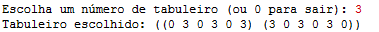
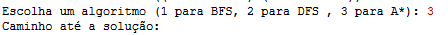
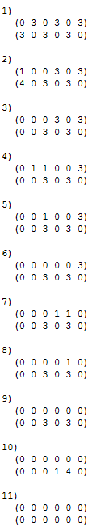
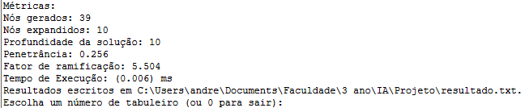

# Manual do Utilizador: Jogo Adji-boto*

Inteligência Artificial - Escola Superior de Técnologia de Setúbal

Docente: Prof. Joaquim Filipe
Alunos:
- 202100723 Rúben Dâmaso
- 201902108 André Castanho

## Índice
- Objetivo do Projeto
- Descrição Geral do Funcionamento
- Como usar o Projeto
- Exemplo de como usar o Projeto
- Informação necessária e produzida
- Limitações do Projeto

## Objetivo do Projeto

O programa desenvolvido tem como objetivo implementar uma variante simplificada do jogo Adji-boto, um jogo de estratégia da família dos jogos de tabuleiro Mancala. Permite que o jogador explore diferentes estratégias e analise soluções utilizando algoritmos de procura. O objetivo principal é capturar o maior número de peças, representando as possíveis sequências de jogadas que levam ao estado final do tabuleiro.

---

## Descrição Geral do Funcionamento

O programa funciona de forma interativa e modular, permitindo:

1. **Configuração Inicial:** O tabuleiro é representado por duas linhas de 6 buracos, cada um com 8 peças inicialmente.
2. **Interação com o Utilizador:** É possível selecionar algoritmos de procura e qual o tabuleiro a ser usado.
3. **Execução:** O programa processa os movimentos, aplica as regras e retorna o estado final do tabuleiro após as jogadas realizadas.
4. **Saída de Dados:** Apresenta a solução encontrada e estatísticas de desempenho (tempo de execução, número de nós gerados, etc.).

---

## Como Usar o Programa

### Passo 1: Iniciar o Programa

1. Execute o arquivo principal `projeto.lisp`.

### Passo 2: Escolher o Problema

1. Selecione um problema inicial do arquivo `problemas.dat`.

2. O sistema carregará o estado inicial do tabuleiro correspondente ao problema escolhido.
    

### Passo 3: Configurar Parâmetros

1. Escolha o algoritmo de procura:
    
    - **BFS:** Procura em largura.
        
    - **DFS:** Procura em profundidade.
        
    - **A***: Procura informada com heurística.


### Passo 4: Visualizar Resultados

1. O programa apresentará:
    
    - Sequência de jogadas desde o estado inicial até o estado final.
        
    - Estatísticas de desempenho do algoritmo utilizado.
        
2. Por fim, os resultados serão gravados em ficheiro *.txt* para análise posterior.
    

### Exemplo

#### Passo 1:
 

#### Passo 2:
 
#### Passo 3:

#### Passo 4:
 
 

 

**Entrada:** Tabuleiro inicial:

```
((0 3 0 3 0 3)
 (3 0 3 0 3 0))
```

**Configuração:**

- Algoritmo: A*

**Saída:** Tabuleiro final:

```
((0 0 0 0 0 0)
 (0 0 0 0 0 0))
```

---

## Informação Necessária e Produzida

### Informação Necessária

- Estado inicial do tabuleiro (definido pelo ficheiro `problemas.dat`).
    
- Algoritmo de procura e parâmetros (definidos pelo utilizador).
    

### Informação Produzida

- Sequência de estados do tabuleiro (na consola LispWorks ou em ficheiro).
    
- Estatísticas do algoritmo:
    
  - Numero de Nós gerados
  - Numero de Nós expandidos
  - Profundidade da solução
  - Penetrância
  - Fator de Ramificação
  - Tempo de Execução (em milissegundos)
        
- Resultados gravados no ficheiro de saída, como `resultados.dat`.
    

---

## Limitações do Programa

1. **Interatividade:** O programa não oferece uma interface gráfica, funcionando apenas via linha de comando.
    
2. **Complexidade dos Algoritmos:** O desempenho pode ser limitado em problemas de grande complexidade devido ao custo computacional, principalmente nos algoritmos DFS e BFS.
    
3. **Erro do Utilizador:** Entrada incorreta pode gerar resultados não esperados ou erros de execução.